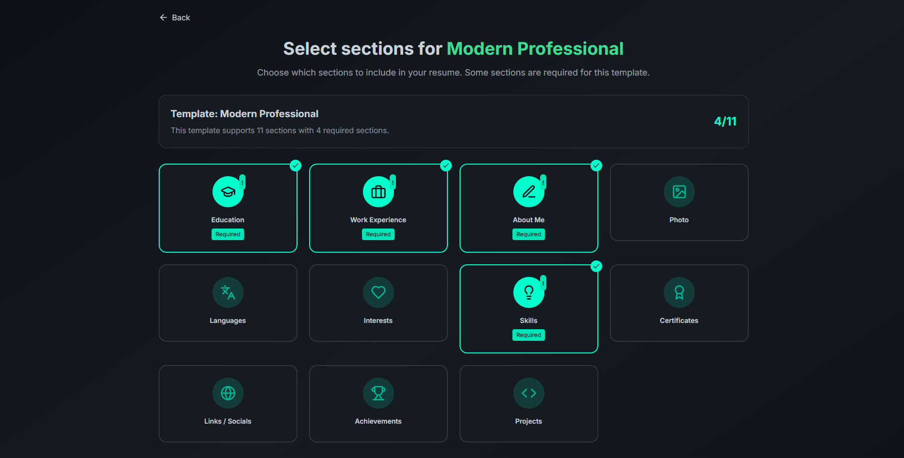

# ResumeAI

A modern AI-powered resume builder application that helps you create, edit, and export professional resumes with ease.

## Features

- **AI-Powered Resume Creation**: Generate professional resume content based on your experience and skills
- **Modern UI**: Clean and intuitive interface for a seamless user experience
- **Markdown Support**: Edit your resume content in markdown format
- **Export Options**: Download your resume as PDF
- **Responsive Design**: Works on desktop and mobile devices
- **Dark/Light Mode**: Choose your preferred theme

## Screenshots





## Technologies Used

- React 18
- TypeScript
- Tailwind CSS
- Vite
- HTML2Canvas & jsPDF for PDF export

## Getting Started

### Prerequisites

- Node.js (v16 or higher)
- npm or yarn

### Installation

1. Clone the repository
   ```
   git clone https://github.com/ClaudiuJitea/ResumeAI.git
   ```

2. Navigate to the project directory
   ```
   cd ResumeAI
   ```

3. Install dependencies
   ```
   npm install
   ```

4. Start the development server
   ```
   npm run dev
   ```

5. Open your browser and visit `http://localhost:5173`

## Building for Production

```
npm run build
```

The build artifacts will be stored in the `dist/` directory.

## Contributing

Contributions are welcome! Feel free to open an issue or submit a pull request.

## License

This project is licensed under the MIT License.
